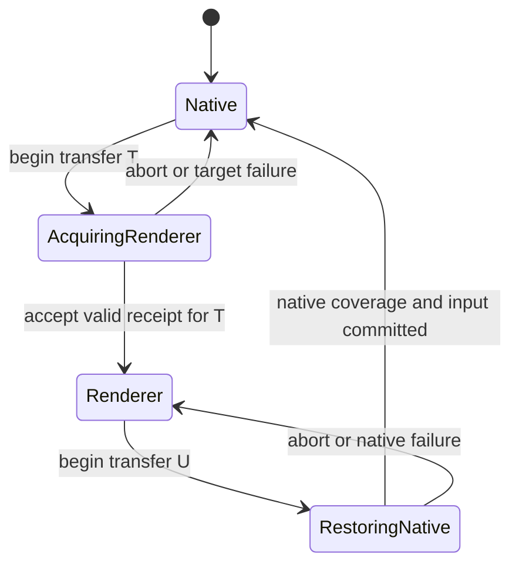

# Proposal: custody protocol v2

**Status:** Proposal for external review. Not a decision or implementation plan.

**Date:** 2026-08-09

**Review goal:** Decide whether Munari should grow a small, explicit transfer
protocol above its source and renderer primitives. The protocol must make a DOM
to WebGL handoff seamless without putting scene policy, React, Three, or video
rules into core.

## Executive summary

Munari currently has good source primitives and one new renderer proof:

- A DOM `Surface` can retain browser layout, focus, and accessibility while its
  pixels are used by WebGL.
- A `FrameSource` gives caller-owned canvas pixels stable source identity and a
  monotonic generation.
- `FrameSurface` samples that generation when Three uploads the texture and
  sends a receipt after the mesh draws it.

That closes one real race. It proves which canvas frame reached one mesh draw.
It does not yet define a complete custody transfer. The caller still coordinates
visibility, input, geometry, cancellation, and recovery with local booleans and
callbacks. A correct pixel generation can still be drawn with stale geometry,
the wrong logical size, or an obsolete transfer intent. A transfer can also wait
forever if its target is hidden, culled, unmounted, or loses its WebGL context.

This proposal makes custody a small transaction:

1. Keep one canonical source of state.
2. Prepare the target presenter while the current presenter stays visible and
   interactive.
3. Require evidence that the target drew the required source and presentation
   state.
4. Commit presentation and input authority together.
5. Release the old presenter only after the commit.
6. Roll back to a stable presenter after any failure or cancellation.

The central rule is **acquire before release**.

Core should own only renderer-free identities, validation rules, and a pure
transfer state machine. The React package should translate Three upload and draw
events into receipts. A scene such as Genie should continue to own its motion,
handoff pose, video decoder, and dock policy.

## 1. Current system

### DOM source path

`createDomTextureSource` adopts or creates a DOM subtree in a hidden canvas,
lets Chrome lay it out, and calls `drawElementImage` during the canvas paint
callback. `Surface` uploads the resulting canvas into Three.

`Surface.onFirstUpload` is a legacy readiness signal. It fires when Munari sets
`texture.needsUpdate`. It does not prove that Three uploaded the texture or that
a mesh drew it. Existing scenes depend on its current early timing, so changing
its meaning would create visibility deadlocks.

### Caller-owned frame path

`FrameSource` currently defines:

- stable `sourceId`;
- monotonic `generation`;
- fixed sRGB and alpha interpretation;
- caller-owned `HTMLCanvasElement` storage;
- notification after the producer publishes new pixels.

`FrameSurface` currently defines:

- a stable `CanvasTexture` for each source runtime;
- generation sampling in `texture.onUpdate`;
- a draw receipt from `mesh.onAfterRender`;
- `surfaceEpoch` to reject receipts from replaced runtimes;
- demand-loop invalidation, texture reallocation, and source replacement.

The retained Chrome gate proves burst coalescing, source replacement, sRGB
pixels, StrictMode effect rehearsal, child identity, and no clear-only frame
during source replacement.

### What remains local to consumers

Consumers still decide:

- when a transfer begins;
- which frame is required;
- whether the target pose and geometry are current;
- which presenter is visible;
- which presenter receives input;
- when an old presenter can be released;
- what happens after resize, reversal, context loss, unmount, or timeout.

That is too much protocol to reconstruct in each lab.

## 2. Proposed language

“Custody” remains the name of the whole protocol. It should no longer mean one
indivisible owner.

| Term | Meaning |
| --- | --- |
| **Canonical source** | The one retained state that all presentations derive from. It can be a DOM root, media decoder, or frame canvas. |
| **Source authority** | The system that owns and mutates the canonical source. This authority does not move during an animation. |
| **Layout host** | The browser location that gives a DOM source layout. Native DOM and an HTML-in-canvas canvas are two possible hosts. |
| **Presenter** | A visible representation of the source, such as native DOM or a WebGL mesh. Two presenters can overlap during acquisition. |
| **Presentation authority** | The presenter that the user should regard as current. |
| **Input authority** | The one surface permitted to receive pointer and keyboard input. |
| **Lease** | Temporary permission to present or accept input. A renderer receives leases; it does not own canonical state. |
| **Transfer** | One attempt to move presentation and input authority from one presenter to another. |
| **Requirement** | The minimum source generation and exact presentation revision the target must prove. |
| **Receipt** | Evidence sampled at renderer boundaries that a target presenter drew the required state. |
| **Epoch** | A lifetime identity used to reject late work from a replaced source, surface, or transfer. |
| **Coverage** | The guarantee that at least one valid presenter covers the handoff region throughout a transfer. |

“Owner” should be reserved for canonical state. DOM and WebGL are presenters.
This distinction removes the apparent contradiction during overlap: two
presenters can exist, but there is still one source authority and one input
authority.

## 3. Protocol laws

These laws should become conformance tests.

1. **One canonical source.** A seamless transfer cannot depend on two media
   decoders, two independent React roots, or two unsynchronized browser states.
2. **Acquire before release.** The current presenter stays valid until the
   target supplies acceptable evidence.
3. **No uncovered frame.** Cancellation, failure, and replacement cannot leave
   both presenters absent.
4. **One input authority.** At most one presenter handles pointer and keyboard
   input at a time.
5. **Evidence, not time.** A frame count, timeout, `requestAnimationFrame`, or
   `texture.needsUpdate` cannot commit renderer acquisition.
6. **Complete presentation proof.** Pixel identity alone is insufficient. The
   receipt must name the active transfer and the presentation revision that
   produced the draw.
7. **Latest pixels can satisfy an older minimum.** Source publications may
   merge before upload. Generation `N + 1` can satisfy a requirement for `N`
   when the source identity is unchanged.
8. **Presentation revision is exact.** A newer geometry or pose is not assumed
   to be equivalent to the requested handoff state. Its revision must match.
9. **Stale work is harmless.** A receipt from an old source, surface runtime,
   presentation revision, or transfer cannot commit current custody.
10. **Rollback is idempotent.** Repeated cancellation or cleanup produces the
    same stable result and releases each resource once.
11. **Pixel interpretation is fixed at source birth.** Color space and alpha
    mode cannot change after first renderer exposure.
12. **Scene policy stays outside core.** Core does not know about video rates,
    animation curves, dock geometry, React, Three, or browser stacking rules.

## 4. Transfer state machine



### Native to renderer

1. The consumer creates transfer `T` with a source requirement and a
   presentation revision.
2. Native DOM keeps presentation and input authority.
3. The renderer becomes renderable behind or under the native presenter.
4. The renderer uploads a source frame and draws the target presentation.
5. The React adapter sends a receipt for `T`.
6. Core validates the receipt.
7. The consumer commits presentation and input authority in one React commit.
8. The native presenter can then be hidden or released.

The target must be renderable while it acquires custody. `visible={false}` on
the mesh or an ancestor prevents `onAfterRender` and therefore prevents proof.
The old presenter provides visual coverage while the target draws underneath.

### Renderer to native

The browser does not expose a direct equivalent of Three's mesh draw receipt
for ordinary DOM composition. The safe reverse transfer is therefore based on
coverage:

1. Restore or reveal the native DOM above the renderer.
2. Confirm that the canonical node is connected, has current layout, and is in
   the covering stack position.
3. Move input authority to native DOM.
4. Keep the renderer behind it until the native coverage boundary has passed.
5. Release the renderer.

The exact native coverage boundary still needs a real-browser probe. A fixed
two-frame delay is not accepted as proof. One candidate is a browser adapter
that combines node connection, layout revision, paint observation where the
platform exposes it, and guaranteed old-presenter coverage. The old renderer
must remain available when that evidence is incomplete.

## 5. Presentation requirements and receipts

The existing `FrameId` should stay small. Transfer and presentation identity
belong in a separate contract.

```ts
interface PresentationRequirement {
  readonly transferId: number
  readonly frame: FrameId
  /** Opaque, monotonic within one presenter. */
  readonly presentationRevision: number
  readonly pixelSize: readonly [width: number, height: number]
}

interface PresentationReceipt {
  readonly transferId: number
  readonly surfaceEpoch: number
  readonly frame: FrameId
  readonly presentationRevision: number
  readonly pixelSize: readonly [width: number, height: number]
}
```

A renderer receipt satisfies a requirement only when:

```ts
receipt.transferId === requirement.transferId
receipt.surfaceEpoch === currentSurfaceEpoch
receipt.frame.sourceId === requirement.frame.sourceId
receipt.frame.generation >= requirement.frame.generation
receipt.presentationRevision === requirement.presentationRevision
receipt.pixelSize[0] === requirement.pixelSize[0]
receipt.pixelSize[1] === requirement.pixelSize[1]
```

`presentationRevision` is intentionally opaque to core. A scene advances it
after it prepares all state that must agree at the seam. For Genie, that state
includes final CPU-deformed geometry, transform, logical size, chrome, and
handoff pose. This avoids adding scene concepts to the protocol.

### Renderer sampling order

The React adapter should build the receipt from the state that actually crossed
the renderer:

1. `texture.onUpdate` records the uploaded `FrameId` and backing pixel size.
2. `mesh.onBeforeRender` records the active transfer and presentation revision.
3. `mesh.onAfterRender` releases the combined receipt.

Sampling the frame before `texture.onUpdate` is incorrect because several
source publications can merge into one upload. Sampling presentation metadata
only after the draw makes it harder to prove which mutable geometry state the
draw used.

### A new transfer must be receiptable without new pixels

An uploaded frame can be reused by a later transfer. The current implementation
holds a one-use pending frame after upload. After that receipt is consumed, a
new acquisition request can wait forever unless the source publishes again.

The renderer runtime should retain the latest uploaded frame. A new transfer or
presentation revision should invalidate the render loop and request a fresh
draw receipt for that transfer, even when the texture bytes did not change.

The receipt means “this target drew these already-uploaded pixels for this
transfer.” It does not require a redundant upload.

## 6. Proposed package boundary

### `@munari/core`

Core should contain only pure contracts and laws:

- transfer, requirement, and receipt identities;
- a `receiptSatisfies(requirement, receipt, currentEpoch)` predicate;
- a small reducer for stable, acquiring, committed, and aborted states;
- laws for idempotent abort and stale-event rejection.

Core should not own clocks, timers, DOM nodes, AbortController, React state, or
Three callbacks.

### `@petepetrash/munari`

The React binding should own:

- `texture.onUpdate`, `mesh.onBeforeRender`, and `mesh.onAfterRender` sampling;
- render-loop invalidation when a requirement changes;
- surface lifetime epochs;
- renderer context-loss reporting;
- additive props or a hook that attaches a presentation requirement to a
  `Surface`;
- presentation and input lease application in React commits.

The low-level `onFrameDrawn` callback can remain useful. A higher-level custody
adapter should validate full presentation receipts before it commits a lease.

### Consumers such as Genie

The consumer should own:

- the canonical video or DOM state;
- motion and geometry laws;
- the exact handoff pose;
- when a transfer begins or reverses;
- presentation revision increments;
- placement and z-order that provide coverage;
- product-specific input behavior.

The consumer should not see texture upload callbacks or infer readiness from a
frame count.

## 7. Failure and reversal rules

| Event | Required result |
| --- | --- |
| Receipt from an old transfer | Ignore it. Do not change authority. |
| Receipt from an old source or surface epoch | Ignore it. Dispose stale renderer resources when their owner cleans up. |
| Source publishes several frames during acquisition | Allow coalescing. Accept the newest uploaded generation that satisfies the minimum. |
| Source identity changes | Abort the current transfer and start a new one with a new requirement. |
| Viewport, layout endpoint, or handoff pose changes | Advance the presentation revision. Rebase or restart acquisition; an old revision cannot commit. |
| User reverses direction during acquisition | Abort the current transfer ID, preserve the stable presenter, and begin the reverse transfer from current stable authority. |
| WebGL context is lost | Abort renderer acquisition or restore native coverage immediately. Never wait for a draw receipt that cannot arrive. |
| Target is hidden or culled | No receipt is possible. Keep the old presenter and allow explicit cancellation. |
| Component unmounts | Abort once, release leases once, restore borrowed nodes, and dispose renderer resources once. |
| Tab resumes after a long pause | Continue from state evidence. Elapsed time alone cannot commit a transfer. |

Core should define the state transitions. The environment adapter should report
the failures. A scene can choose whether to rebase, restart, or stay native.

## 8. Input authority

Input is part of custody, but it is not the same as presentation.

During renderer acquisition:

- native DOM remains the only input authority;
- the renderer can draw but cannot handle target interactions;
- a full-screen renderer canvas must not begin swallowing page input because a
  stale hover result said that a mesh was once under the pointer.

At commit:

- presentation and input authority change in one React commit;
- active pointer capture has an explicit policy: retain it on the old authority
  until release, or cancel and reacquire it deliberately;
- focus remains on the canonical DOM node when the transfer model supports it.

During native restoration, input returns to native DOM before the old renderer
is released, because renderer coverage can remain underneath without accepting
input.

The first implementation can expose an explicit `interactive` lease rather than
trying to automate every pointer rule in core.

## 9. Borrowed DOM is a later adapter

Generic live DOM cannot be exact when it is rendered twice. Lifted React state
does not share browser-owned state such as focus, selection, scroll, CSS
animation time, canvas pixels, iframe state, or media decoder position.

A future borrowed-DOM adapter should move one persistent React-owned host
between its native slot and the HTML-in-canvas layout canvas. The existing spike
showed that `Element.moveBefore` preserves the tested browser-owned state when
the canvas has `layoutSubtree = true`.

This should be described as a **borrowed layout lease**, not borrowed source
ownership. The consumer still owns the canonical DOM root. The adapter must:

- record the original parent and anchor;
- require `layoutSubtree = true` in the capture host;
- use identity-preserving moves;
- return the node on abort, unmount, or context loss;
- make return idempotent;
- keep a valid texture as coverage across both moves.

Borrowed DOM should stay opt-in until a second real consumer proves the API. It
does not solve native-video versus canvas color differences. Exact video should
continue to use one decoder and one shared frame canvas in both presentations.

## 10. Migration plan

### Slice 1: complete the frame receipt

- Add transfer ID, presentation revision, and uploaded pixel size.
- Retain the latest uploaded frame so a new transfer can request a new draw
  receipt without a new source publication.
- Add pure receipt validation in core.
- Keep the existing DOM `Surface` behavior unchanged.

### Slice 2: adopt the protocol in Genie

- Keep one video decoder and one shared canvas.
- Publish decoded canvas generations.
- Issue the handoff requirement only after final geometry and pose are written.
- Keep the old presenter and input authority until the matching receipt.
- Abort or revise the transfer on resize, immediate reversal, or context loss.

### Slice 3: add a DOM presentation receipt

- Separate DOM source readiness from renderer presentation.
- Keep `onFirstUpload` with its current meaning during migration.
- Review Flight, Genie, Passage, Veil, and Wake individually. Do not rename their
  callbacks mechanically.

### Slice 4: consider borrowed layout custody

- Build it only after one persistent-root consumer and one additional consumer
  prove the same contract.
- Keep current owned DOM adoption as the default.

## 11. Required proof

### Core conformance

- valid receipt acceptance;
- stale transfer, source, surface, and revision rejection;
- generation coalescing;
- exact pixel-size checks;
- idempotent abort and release;
- immediate reversal.

### Real React and Three

- upload, before-render, and after-render ordering;
- a new receipt from an already-uploaded frame;
- demand-loop invalidation for new requirements;
- StrictMode setup, cleanup, and replacement;
- source replacement with child identity preserved;
- hidden and culled targets do not produce false receipts;
- context loss between upload and draw;
- resize between publication, upload, and draw;
- no clear-only renderer frame during replacement.

### Genie end-to-end

- required and presented frame generation match;
- required and presented geometry revision match;
- no duplicate decoder;
- no video time or color jump at either handoff;
- no stale rest-position flash;
- one input authority through catch, release, minimize, and restore;
- resize, scroll, hidden-tab resume, rapid reverse, and context-loss recovery.

## 12. Alternatives considered

### Keep protocol in each lab

Rejected. The renderer cannot be observed correctly from a lab without exposing
private Three callbacks. Every lab would rebuild stale-event, cancellation, and
visibility rules.

### Commit after one or two animation frames

Rejected. Frame timing is not evidence. CPU stalls, background tabs, demand
rendering, and compositor scheduling break the assumption.

### Put every source mode into the current DOM `Surface`

Rejected. This adds frame-source branches through DOM adoption, layout, LOD,
focus, chrome, hit testing, and pointer forwarding. The isolated frame path has
already shown a smaller blast radius.

### Render arbitrary live DOM twice

Rejected for an exact contract. Two trees do not share browser-owned state.

### Move everything to WebGL permanently

Rejected as the default. It weakens Munari's central promise that retained DOM
remains real, selectable, accessible, and natively laid out at rest.

### Adopt direct Three `HTMLTexture` now

Deferred. Its color and first-presentation behavior have not passed the same
pixel and generation proof as the existing canvas path.

## 13. Risks

1. **The protocol can become a second system.** A transfer reducer is useful;
   a universal media, animation, and renderer framework is not.
2. **Presentation revision can become vague.** Consumers need a clear rule for
   when to advance it. If every property becomes a separate generation, the API
   becomes hard to use.
3. **Native restoration evidence is weaker than renderer evidence.** The design
   must be honest about this asymmetry and rely on coverage until the platform
   provides stronger proof.
4. **Input transfer has browser edge cases.** Pointer capture, focus, selection,
   and touch need explicit tests, not inferred parity.
5. **A receipt can prove the wrong target.** The callback must remain tied to
   the exact mesh and draw that will become visible, not a hidden readiness
   probe with different geometry or material.
6. **One consumer can overfit core.** The first core surface should stay small
   and pure. Borrowed DOM should wait for a second consumer.

## 14. Questions for the second reviewer

Please challenge the model rather than its names or syntax.

1. Is the split between source authority, layout host, presenter, presentation
   authority, and input authority complete? Which authority is missing?
2. Is an opaque `presentationRevision` sufficient to prove geometry, transform,
   logical size, chrome, and material state? Would a structured stamp be safer?
3. Must a receipt include uploaded pixel size and logical size, or should those
   be part of the presentation revision?
4. Is `texture.onUpdate` → `mesh.onBeforeRender` → `mesh.onAfterRender` enough to
   identify the state that actually reached the framebuffer?
5. How should a reused, already-uploaded texture produce a fresh receipt without
   a redundant upload?
6. What is the smallest honest native-DOM coverage proof available in current
   browsers?
7. Should context-loss recovery belong to the Canvas host, each Surface, or the
   custody coordinator?
8. Does a pure transfer reducer in core earn its place with Genie as the first
   consumer, or should the first coordinator stay local until a second scene
   arrives?
9. Which race can still produce a frame with neither valid presenter?
10. Which part of this proposal is unnecessary? What is the smallest design
    that preserves the same laws?

Please identify any fatal flaw, give a concrete failure sequence, and propose a
smaller safe alternative where possible.

## Recommendation

Accept the model as a direction, but implement only Slice 1 before reviewing it
again. The immediate value is a complete, reusable presentation receipt and a
pure validator. That is enough to harden Genie without committing Munari to a
large custody framework.

Borrowed DOM, generic input automation, and a public transfer coordinator should
remain proposals until real consumers prove their exact shape.

## Evidence in this repository

- `packages/core/src/paint/frameSource.ts`
- `packages/react/src/primitives/FrameSurface.tsx`
- `packages/react/src/primitives/Surface.tsx`
- `instruments/frame-surface/`
- `docs/decisions.md` decision #24
- `docs/spikes/surface-frame-contract.md`
- `docs/spikes/genie-seam.md`
